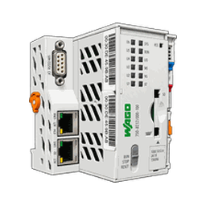

# WAGO 750-8212 PFC200 Modbus — Home Assistant

  

Intégration Home Assistant locale pour exposer un **WAGO 750-8212 PFC200** via **Modbus/TCP**.

Les entités ne sont pas codées en dur : la table Modbus est entièrement configurable depuis Home Assistant et peut être remplie rapidement par import CSV.

## Fonctionnalités

- Modbus/TCP 100 % local
- configuration et reconfiguration de l'adresse IP, du port et de l'Unit ID
- timeout, délai de reconnexion et intervalle d'interrogation configurables
- définition des quatre plages mémoire Modbus : Coils, Discrete Inputs, Holding Registers et Input Registers
- jusqu'à **100 points configurables**
- ajout, modification, duplication et suppression depuis Home Assistant
- adresses Modbus proposées automatiquement depuis la plage configurée, avec indication **disponible / déjà utilisée**
- saisie manuelle d'une adresse conservée tant qu'elle appartient à la plage configurée
- listes d'unités, `device_class` et `state_class` avec saisie personnalisée possible
- déplacement simultané de plusieurs entités d'une section vers une autre
- choix d'une section existante ou création d'une nouvelle section/sous-section
- suppression automatique des sections et sous-sections devenues vides
- navigation **Retour** dans l'assistant de configuration
- import et export CSV depuis l'interface Home Assistant
- regroupement des lectures par blocs Modbus
- sections et sous-sections hiérarchiques (`Parent / Enfant`)
- formulaires dynamiques : seuls les paramètres utiles au type d'entité choisi sont affichés
- `sensor`, `binary_sensor`, `switch`, `number`, `button`, `select`
- `bool`, `uint16`, `int16`, `uint32`, `int32`, `float32`
- facteur, offset, précision, min, max, pas et unité
- extraction d'un bit dans un registre
- inversion booléenne
- ordre des octets et des mots
- commandes impulsionnelles
- relecture automatique après écriture
- identifiant stable par point
- diagnostics de communication sur le WAGO principal
- logo et icône transparents dédiés pour HACS et Home Assistant

## Branding

Le branding représente le contrôleur WAGO dans un style dessin technique, sans ombre et sur fond transparent.

Les variantes sont générées automatiquement avec des marges de sécurité afin d'éviter tout recadrage dans Home Assistant :

- `brand/` — branding du dépôt / HACS ;
- `custom_components/wago_750_8212_pfc200/brand/` — branding local Home Assistant ;
- `icon.png` et `logo.png` en 256 × 256 ;
- `icon@2x.png` et `logo@2x.png` en 512 × 512 ;
- variantes `dark_*` incluses.

## Diagnostics du WAGO principal

Quatre entités de diagnostic sont créées directement sur le contrôleur WAGO :

- **Dernière communication réussie** — date/heure de la dernière lecture Modbus complète réussie
- **Durée de communication** — durée du dernier cycle de communication, en millisecondes
- **Échecs de communication consécutifs** — compteur remis à zéro après une lecture réussie
- **Automate en ligne** — capteur binaire de connectivité basé sur le résultat du dernier cycle Modbus

Les diagnostics restent disponibles lorsque la communication tombe. `Automate en ligne` passe à **OFF** au lieu de devenir indisponible.

## Installation HACS

Ajoutez `https://github.com/jptstar/wago_modbus` comme dépôt personnalisé HACS de type **Intégration**.

Installez ensuite **WAGO 750-8212 PFC200 Modbus**, redémarrez Home Assistant et ajoutez l'intégration depuis **Paramètres → Appareils et services → Ajouter une intégration**.

### Versionnement HACS

Les versions sont publiées sous forme de **GitHub Releases**. Un workflow GitHub crée automatiquement la release correspondant à la valeur `version` du `manifest.json`.

## Mémoire Modbus par défaut

| Table | Start | Taille | Plage |
|---|---:|---:|---:|
| Coils | 0 | 48 | 0–47 |
| Discrete Inputs | 50 | 8 | 50–57 |
| Holding Registers | 60 | 40 | 60–99 |
| Input Registers | 100 | 3 | 100–102 |

Elles restent modifiables dans **Configurer → Mémoire Modbus**.

## Éditeur de points

L'ajout ou la modification d'un point se fait sous forme d'assistant :

1. identité, type d'entité et section ;
2. table Modbus ;
3. adresse Modbus ;
4. format du registre si nécessaire ;
5. paramètres spécifiques au type choisi.

À l'étape **Adresse Modbus**, l'intégration construit la liste à partir de la plage mémoire configurée. Chaque adresse est marquée **disponible**, **adresse actuelle** ou **déjà utilisée**. La saisie manuelle reste possible.

Pour les capteurs et nombres, les unités courantes sont proposées dans une liste déroulante avec saisie libre. Les classes d'appareil et `state_class` sont également proposées lorsque cela a du sens.

## Déplacer plusieurs entités entre sections

Le déplacement en masse ne fusionne jamais les sections.

Le parcours est :

1. **Choisir la section / sous-section source** ;
2. **Sélectionner une ou plusieurs entités** présentes exactement dans cette section ;
3. **Choisir la section / sous-section destination** ;
4. valider.

Seules les entités cochées sont déplacées. Les autres entités de la section source restent inchangées.

La destination peut être :

- une section ou sous-section existante ;
- **WAGO principal** pour retirer l'affectation de section ;
- **Nouvelle section / sous-section** pour créer la destination à la volée.

Si la section source devient vide après le déplacement, elle est supprimée automatiquement au rechargement.

## Import CSV

Le fichier `examples/wago_points.csv` est prérempli avec les points explicitement présents dans les flows Node-RED transmis.

Dans Home Assistant : **Configurer → Importer un CSV → choisir le fichier → Remplacer/Fusionner → vérifier → confirmer**.

Le CSV est validé avant import : plages mémoire, types, écritures interdites, min/max/pas, facteur, bits, IDs, limite de 100 points, etc.

Pour une hiérarchie, la colonne `section` peut contenir par exemple `Arrosage gazon / Terrasse`.

## Conversion

`valeur HA = valeur brute × scale + offset`

L'écriture applique automatiquement la conversion inverse.

## Point à vérifier

Les flows fournis utilisent le **Coil 21 à la fois pour “Gazon pool house” et “GG haies chemin”**. Vérifiez l'adresse réelle dans CODESYS avant utilisation en production.

## Version

**0.1.17**
